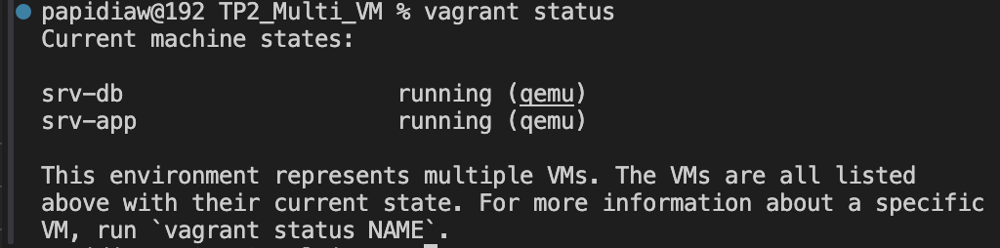

# TP2 - Automatisation et Architecture Multi-VM

Ce projet correspond au deuxieme travail pratique. Il vise a deployer et automatiser une architecture client-serveur distribuee sur deux machines virtuelles gerees par Vagrant (fournisseur QEMU).

## Structure du projet

```text
TP2_Multi_VM/
├── Vagrantfile            # Configuration Vagrant pour les deux machines virtuelles
├── db_provision.sh        # Script d'installation et configuration de MySQL sur srv-db
├── app_provision.sh       # Script d'installation de Java (JDKs), Tomcat 9 et deploiement sur srv-app
├── deploy.sh              # Script utilitaire de gestion du serveur Tomcat (demarrage, arret, logs)
├── app/                   # Repertoire contenant l'application Web pre-compilee (.war) a deployer
└── sql/                   # Repertoire contenant d'eventuels scripts SQL d'initialisation additionnels
```

## Description de l'Architecture

L'environnement met en place deux serveurs sous Ubuntu 22.04 LTS :

1. **srv-db** : Ce serveur heberge le systeme de gestion de base de donnees MySQL. La base de donnees applicative `appdb` et l'utilisateur `appuser` sont crees automatiquement lors du provisionnement. Le port 3306 de la machine invitee est redirige vers le port 3306 de l'hote.
2. **srv-app** : Ce serveur applicatif embarque les JDKs (8, 11, et 17) ainsi que le serveur web Apache Tomcat 9 (service systemd). Il s'occupe egalement de recuperer l'application `monapp-db.war` dans le dossier partage et de la deployer dans Tomcat. Le port 8080 de cette machine invitee est redirige vers le port 8080 de l'hote.

## Etapes de deploiement et de lancement

### 1. Demarrage de l'environnement

Ouvrez un terminal, placez-vous dans le dossier `TP2_Multi_VM` et executez la commande suivante :

```bash
cd TP2_Multi_VM
vagrant up
```

L'installation est entierement automatisee par le `Vagrantfile`.

- Dans un premier temps, Vagrant initialise et configure **srv-db**.
- Ensuite, Vagrant initialise **srv-app**, qui detecte dynamiquement l'architecture, installe les environnements d'execution Java, configure Tomcat et deploie le fichier WAR fourni dans le dossier `app/`.

### 2. Validation de l'installation

A des fins d'evaluation, voici les commandes exactes que vous devez taper dans votre terminal pour effectuer les verifications et realiser les captures d'ecran.

---

### [CAPTURE_ECRAN_1 : Statut de l'environnement Vagrant]

**Commande a taper sur votre machine (Hote) :**

```bash
vagrant status
```



*Justification du resultat attendu : L'execution de la commande "vagrant status" dans ce repertoire doit afficher que les machines "srv-app" et "srv-db" sont toutes les deux a l'etat "running" (en cours d'execution). Cela certifie que la configuration multi-VM de Vagrant a reussi et que les ressources materielles allouees via QEMU fonctionnent sans erreur.*

---

### [CAPTURE_ECRAN_2 : Configuration de la base de donnees sur srv-db]

**Commandes a taper sur votre machine (Hote) :**

```bash
# 1. Se connecter en SSH a la machine base de donnees
vagrant ssh srv-db

# 2. Une fois dans la machine, se connecter a MySQL :
mysql -h 127.0.0.1 -u appuser -pAppPass123! appdb

# 3. Verifier la base de donnees :
SHOW TABLES;
SELECT * FROM messages;

# 4. Quitter MySQL et la VM
exit
exit
```

*Justification du resultat attendu : Apres connexion SSH sur "srv-db" (via "vagrant ssh srv-db"), cette capture montre l'acces direct a la ligne de commande MySQL (interface "mysql>"), validant ainsi que le service MySQL ecoute correctement sur les interfaces reseau et que les permissions de la base "appdb" pour "appuser" sont fonctionnelles.*

---

### [CAPTURE_ECRAN_3 : Test du client applicatif via le reseau invite-hote]

**Action a faire sur votre machine (Hote) :**
Ouvrez votre navigateur web (Chrome, Firefox, Safari) et allez a l'adresse suivante :

```text
http://localhost:8080/monapp-db/
```

*Justification du resultat attendu : En visitant l'URL "<http://localhost:8080/monapp-db/>" sur le navigateur de l'hote, l'affichage de la banniere confirmant une connexion reussie a la base de donnees demontre que : (1) Le serveur Tomcat sur srv-app expose correctement son service sur le port 8080, (2) l'application WAR a ete entierement deployee, et (3) la connectivite reseau entre la couche applicative (srv-app) et la couche de donnees (srv-db) est parfaitement operationnelle.*

---

## Arret et nettoyage de l'environnement

**Pour arreter les deux machines afin de preserver les ressources de votre ordinateur :**

```bash
vagrant halt
```

**Pour supprimer completement les machines virtuelles crees :**

```bash
vagrant destroy -f
```
